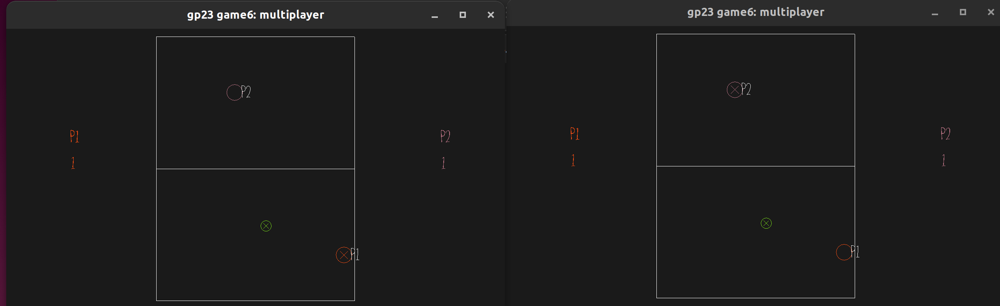

# Air Hockey

Author: Yuan Meng

Design: When I submitted the design, I didn't look at the base code yet. After that I noticed that the base code itself is very similar to a air hockey game so I just made some modifications based on the base code. I didn't change the collison/velocity part as I found out this could be directly applied to air hockey.

Networking: Except from the player position and velocity, I need to transmit player index, ball location, player score and winning status through the Internet. All updates are computed in the server.

Screen Shot:

How To Play:

WASD to move, hit the ball

Sources: base code itself

This game was built with [NEST](NEST.md).

